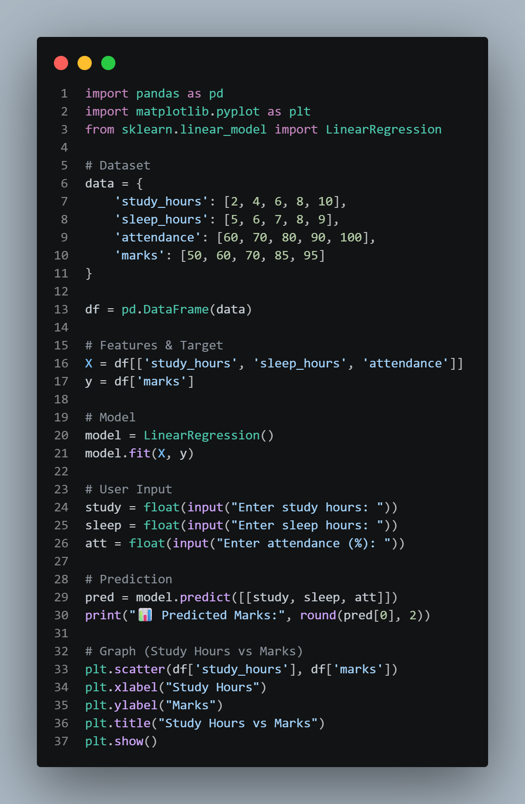
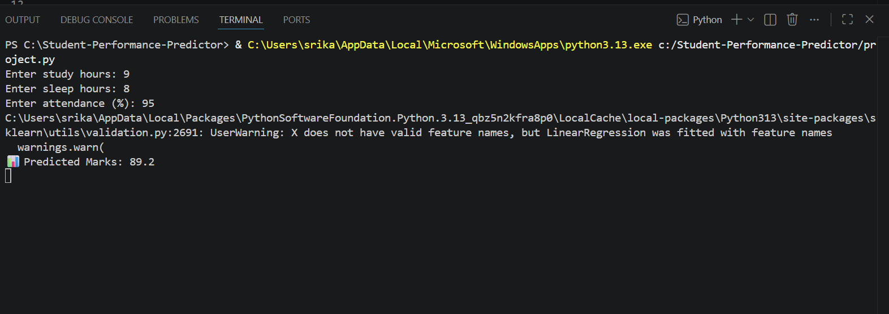
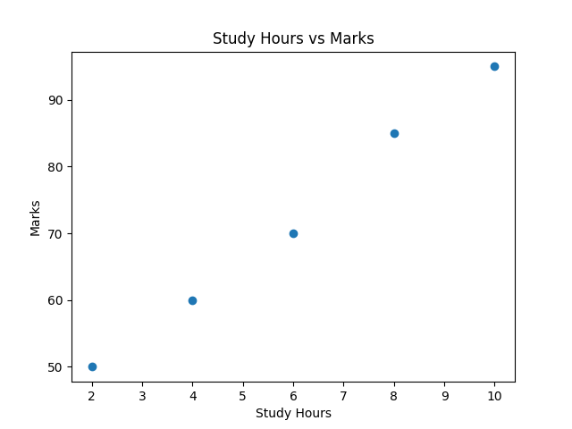

# 📊 Student Performance Prediction using Machine Learning

## 📌 Problem Statement
This project predicts student marks based on study hours, sleep, and attendance.

---

## 🚀 Project Description
This system uses machine learning to analyze student habits and predict their performance.

---

## ⚙️ Technologies Used
- Python
- Pandas
- Scikit-learn
- Matplotlib

---

## 🧠 How It Works
1. Data is created for students
2. Model is trained using Linear Regression
3. User enters values
4. System predicts marks

---

## ▶️ How to Run
1. Install Python
2. Install libraries:
   pip install pandas matplotlib scikit-learn
3. Run:
   python project.py

---

## 📸 Output Screenshots

### Code

### Output

### Graph

---

## 📌 Conclusion
This project shows how machine learning can help predict student performance.
The model demonstrates a positive relationship between study habits and academic performance.

---

## 👨‍💻 Author
Srikanth
